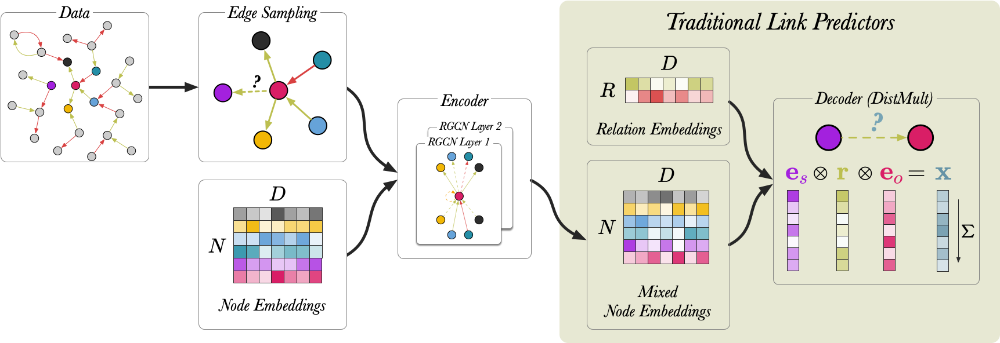
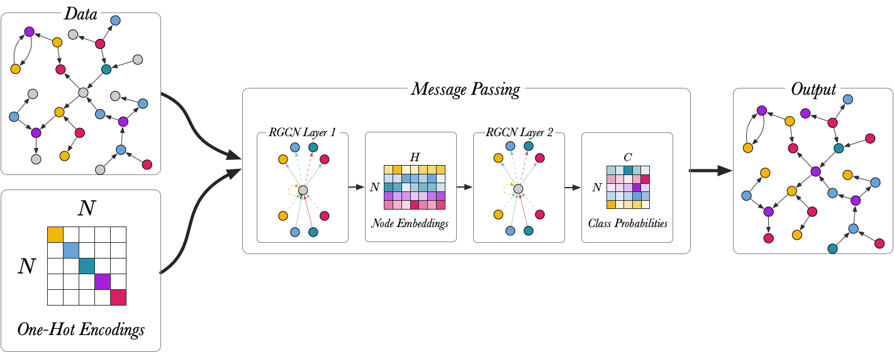

# Torch-RGCN 

Torch-RGCN is a PyTorch implementation of the RGCN, originally proposed by Schlichtkrull *et al.* in  
[Modeling Relational Data with Graph Convolutional Networks](https://arxiv.org/abs/1703.06103).
 
In our [paper](https://arxiv.org/abs/2107.10015), we reproduce the link prediction  and node classification experiments from the original 
paper and using our reproduction we explain the RGCN. Furthermore, we present two new configurations of the RGCN. 

## Link prediction for FB-Toutanova (FB15K-237)
Epoch : 3000
MRR (Filtered) : 0.153
Hits@1(filtered) : 0.073
Hits@3(filtered) : 0.162
Hits@10(filtered) : 0.323

## Getting started

Requirements: 
* Conda >= 4.8
* Python >= 3.7

Do the following: 

1. Download all datasets: `bash get_data.sh`

2. Install the dependencies inside a new virtual environment: `bash setup_dependencies.sh`

3. Activate the virtual environment: `conda activate torch_rgcn_venv`

4. Install the torch-RGCN module: `pip install -e .`  

## Usage

### Configuration files

The hyper-parameters for the different experiments can be found in [YAML](https://yaml.org/) files under 
[configs](configs). The naming convention of the files is as follows: `configs/{MODEL}/{EXPERIMENT}-{DATASET}.yaml`

### Models
* `rgcn` - Standard RGCN Model 
* `c-rgcn` - Compression RGCN Model 
* `e-rgcn` - Embedding RGCN Model

### Experiments
* `lp` - Link Prediction
* `nc` - Node Classification 

### Datasets

#### Link Prediction
 
 * `WN18`  
 * `FB-Toy`

#### Node Classification 

 * `AIFB`  
 * `MUTAG` 
 * `BGS` 
 * `AM`

## Part 1: Reproduction  

### Link Prediction 

Original Link Prediction Implementation: https://github.com/MichSchli/RelationPrediction 

To run the link prediction experiment using the RGCN model using:

`python experiments/predict_links.py with configs/rgcn/lp-{DATASET}.yaml`

Make sure to replace `{DATASET}` with one of the following dataset names: `FB-toy` or `WN18`.

### Node Classification

Original Node Classification Implementation: https://github.com/tkipf/relational-gcn

To run the node classification experiment using the RGCN model using:

`python experiments/classify_nodes.py with configs/rgcn/nc-{DATASET}.yaml`

Make sure to replace `{DATASET}` with one of the following dataset names: `AIFB`, `MUTAG`, `BGS` or `AM`.

## Part 2: New RGCN Configurations 

### Node Classification with Node Embeddings 

To run the node classification experiment use: 

`python experiments/classify_nodes.py with configs/e-rgcn/nc-{DATASET}.yaml`

Make sure to replace `{DATASET}` with one of the following dataset names: `AIFB`, `MUTAG`, `BGS` or `AM`.

### Link Prediction Compressed Node Embeddings

To run the link prediction experiment use: 

`python experiments/predict_links.py with configs/c-rgcn/lp-{DATASET}.yaml`

Make sure to replace `{DATASET}` with one of the following dataset names: `FB-toy`, or `WN18`.

---

### Dataset References

#### Node Classification

 * `AIFB` from 
 Stephan Bloehdorn and York Sure. 
 *[Kernel methods for mining instance data in ontologies.](https://link.springer.com/content/pdf/10.1007%2F978-3-540-76298-0_5.pdf).* 
 In The Semantic Web, 6th International Semantic Web Conference,  2007. 
 * `MUTAG` from 
 A. K. Debnath, R. L. Lopez de Compadre, G. Debnath, A. J.Shusterman, and C. Hansch. 
 *[Structure-activity relationship of mutagenic aromatic and heteroaromatic nitro-compounds correlation 
 with molecular orbital energies and hydrophobicity](https://pubs.acs.org/doi/pdf/10.1021/jm00106a046?casa_token=ECo0FUp3gNoAAAAA:6Xgkt3vGuQeVFnGwlPlyDWm-fIflRmsRe7s5X_SH143O4-wVz5eIMHj_cmDvBWCVon6LLvVt0nTgy-4).* 
 J Med Chem,34:786–797, 1991.
 * `BGS` from 
 de Vries, G.K.D.
 *[A fast approximation of the Weisfeiler-Lehman graph kernel for RDF data](https://link.springer.com/content/pdf/10.1007%2F978-3-642-40988-2_39.pdf).* 
 In European Conference on Machine Learning and Principles and Practice of Knowledge Discovery in Databases, 2013.
 * `AM` from 
de Boer, V., Wielemaker, J., van Gent, J., Hildebrand, M., Isaac, A., van Ossenbruggen, J., Schreiber, G.
*[Supporting linked data production for cultural heritageinstitutes: The amsterdam museum case study](https://link.springer.com/content/pdf/10.1007%2F978-3-642-30284-8_56.pdf).* 
In The Semantic Web: Research and Applications, 2012.

#### Link Prediction
 
 * `WN18` from 
 Antoine Bordes, Nicolas Usunier, Alberto Garcia-Duran , Jason Weston, and Oksana Yakhnenko. 
 *[Translating embeddings for modeling multi-relational data](http://papers.nips.cc/paper/5071-translating-embeddings-for-modeling-multi-rela)*.
 In Advances in Neural Information Processing Systems, 2013. 
 * `FB-Toy` from 
 Daniel Ruffinelli, Samuel Broscheit, and Rainer Gemulla. 
 *[You CAN teach an old dog new tricks! on training knowledge graph embeddings](https://openreview.net/pdf?id=BkxSmlBFvr)*.
 In International Conference on Learning Representations, 2019. 
 
